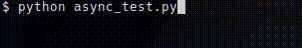

Proggy
======

Progressively progressing through progress bar generation.

Proggy generates text-based progress bars. Mildly inspired by Rust's
[indicatif](https://github.com/mitsuhiko/indicatif).

Proggy only renders progress bars to a string. Displaying them is, as of now,
not handled and left to the user.

Examples
--------

### API usage

```
>>> from proggy import ProgressBar
>>> pb = ProgressBar(30, 100, progress=75)
>>> pb.render()
'⣿⣿⣿⣿⣿⣿⣿⣿⣿⣿⣿⣿⣿⣿⣿⣿⣿⣿⣿⣿⣿⣿⡇       '
```

### CLI output

#### Single progress bar (`test.py`):
```python
import time

from proggy import BarInfo
from proggy.tty import TTYProgressBar


with TTYProgressBar(BarInfo(size=30, total=100)) as p:
    for i in range(100):
        time.sleep(0.1)
        p.progress += 1
```

Output:


#### Multi-progress bar with `asyncio` (`async_test.py`):
```
from asyncio import ensure_future, run, sleep

from proggy import BarInfo, LogicalProgressBar
from proggy.types import ProgressBar
from proggy.tty import TTYMultiProgressBar


async def task1(p: ProgressBar):
    for _ in range(100):
        await sleep(0.1)
        p.progress += 1


async def task2(p: ProgressBar):
    for _ in range(50):
        await sleep(0.1)
        p.progress += 1


async def main():
    with TTYMultiProgressBar(bar_infos=[
        BarInfo(size=30, total=100),
        BarInfo(size=30, total=50),
    ]) as mp:
        x = ensure_future(task1(mp.bar_at(0)))
        await task2(mp.bar_at(1))
        await x

run(main())
```

Output:


